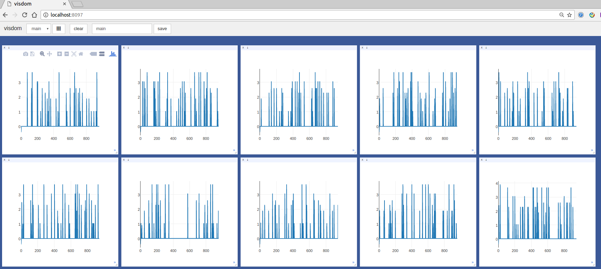

# [Asynchronous Advantage Actor-Critic (A3C) Algorithms](https://arxiv.org/abs/1602.01783) in PyTorch

### Citation
```
@inproceedings{mnih2016asynchronous,
  title={Asynchronous methods for deep reinforcement learning},
  author={Mnih, Volodymyr and Badia, Adria Puigdomenech and Mirza, Mehdi and Graves, Alex and Lillicrap, Timothy P and Harley, Tim and Silver, David and Kavukcuoglu, Koray},
  booktitle={International Conference on Machine Learning},
  year={2016}}
```

This repository contains an implementation of Adavantage async Actor-Critic (A3C) in PyTorch based on the original paper by the authors and the PyTorch implementation of [ikostrikov/pytorch-a3c](https://github.com/ikostrikov/pytorch-a3c) and [onlytailei/A3C-PyTorch](https://github.com/onlytailei/A3C-PyTorch). I adapted the orginal code to PyTorch 0.2.0.

## Dependencies
* Python 2.7
* PyTorch (0.2.0.post1)
* gym (0.9.2) (OpenAI)
* universe (0.21.5) (OpenAI)
* opencv-contrib-python (3.3.0.9)
* visdom (0.1.5) (for visualization)

## Changes for PyTorch (0.2.0.post1)
1.
```
It's Alive!
[2017-08-20 16:51:59,462] Making new env: PongDeterministic-v4
Traceback (most recent call last):
  File "train.py", line 170, in <module>
    model = A3CAtari(args_, logger)
  File "train.py", line 29, in __init__
    self.shared_model = A3CLSTMNet(self.env.state_shape, self.env.action_dim)
  File "/home/jack/Applications/A3C-PyTorch/A3C.py", line 64, in __init__
    self.linear_policy_1.weight.data, 0.01)
  File "/home/jack/Applications/A3C-PyTorch/A3C.py", line 25, in normalized_columns_initializer
    out *= std / torch.sqrt(out.pow(2).sum(1).expand_as(out))
  File "/home/jack/Applications/pythonEnv/python2/local/lib/python2.7/site-packages/torch/tensor.py", line 236, in expand_as
    return self.expand(tensor.size())
RuntimeError: The expanded size of the tensor (256) must match the existing size (6) at non-singleton dimension 1. at /pytorch/torch/lib/TH/generic/THTensor.c:308
```
Change `out *= std / torch.sqrt(out.pow(2).sum(1).expand_as(out))` to `out *= std / torch.sqrt(out.pow(2).sum(1, keepdim=True).expand_as(out))`


## Training

```
./train_lstm.sh
```

### Test wigh trained weight after 169000 updates for _PongDeterminisitc-v4_.
```
./test_lstm.sh 169000
```

A test result [video](https://youtu.be/Ohpo6BcMgZw) is available.

### Check the loss curves of all threads in http://localhost:8097


## References

* [Asynchronous methods for deep reinforcement learning on arXiv](https://arxiv.org/abs/1602.01783).
* [Ilya Kostrikov's implementation](https://github.com/ikostrikov/pytorch-a3c).
* [onlytailei/A3C-PyTorch](https://github.com/onlytailei/A3C-PyTorch).
